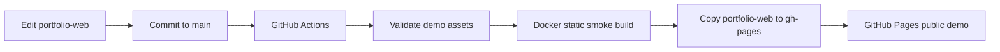

# Deployment Guide

This repository deploys only the public demo website. The real ML pipeline remains a local/GPU workstation workflow because it depends on model weights, private source media, and large generated artifacts.

## Recommended Deployment: GitHub Pages

The public demo site is the static directory:

```text
portfolio-web/
```

The repository includes:

```text
.github/workflows/deploy-demo-pages.yml
```

On pushes to `main` that touch `portfolio-web/`, `docker/portfolio.*`, or the workflow itself, GitHub Actions validates the static assets, builds the Nginx Docker smoke image, and publishes `portfolio-web/` to the `gh-pages` branch.

Expected public URL:

```text
https://justin21523.github.io/3d-animation-lora-pipeline/
```

## Deployment Flow



## Local Preview

```bash
python -m http.server 8080 -d portfolio-web
```

Open:

```text
http://localhost:8080
```

## Docker/Nginx Preview

```bash
docker build -f docker/portfolio.Dockerfile -t 3d-animation-lora-pipeline-demo .
docker run --rm -p 8080:80 3d-animation-lora-pipeline-demo
```

Open:

```text
http://localhost:8080
```

## Refresh Demo Data

Generate or refresh the public manifest and product-style synthetic assets:

```bash
python scripts/demo/run_demo_pipeline.py --skip-pipeline
```

Run the full CPU-safe stub pipeline before refreshing the manifest:

```bash
bash bash/run_full_pipeline_stub.sh
python scripts/demo/run_demo_pipeline.py --skip-pipeline
```

The manifest is written to:

```text
portfolio-web/demo-data/manifest.json
```

## Public Verification

After the workflow completes, verify:

```bash
curl -fsSI https://justin21523.github.io/3d-animation-lora-pipeline/
curl -fsSI https://justin21523.github.io/3d-animation-lora-pipeline/assets/video/demo-walkthrough.mp4
curl -fsSI https://justin21523.github.io/3d-animation-lora-pipeline/assets/screenshots/demo-home-desktop.png
curl -fsSL  https://justin21523.github.io/3d-animation-lora-pipeline/demo-data/manifest.json
```

Each static asset should return `200 OK`.

## Netlify or Vercel Alternative

The project is also suitable for Netlify or Vercel as a static site:

| Setting | Value |
| --- | --- |
| Build command | none |
| Publish directory | `portfolio-web` |
| Framework preset | static site |

These are alternatives only. GitHub Pages is the preferred option because the site has no backend and already lives beside the repository.

## Not Recommended

Render/Railway-style app hosting is unnecessary for the portfolio demo because there is no persistent backend service. Real ML execution should stay on a GPU workstation or batch environment.
