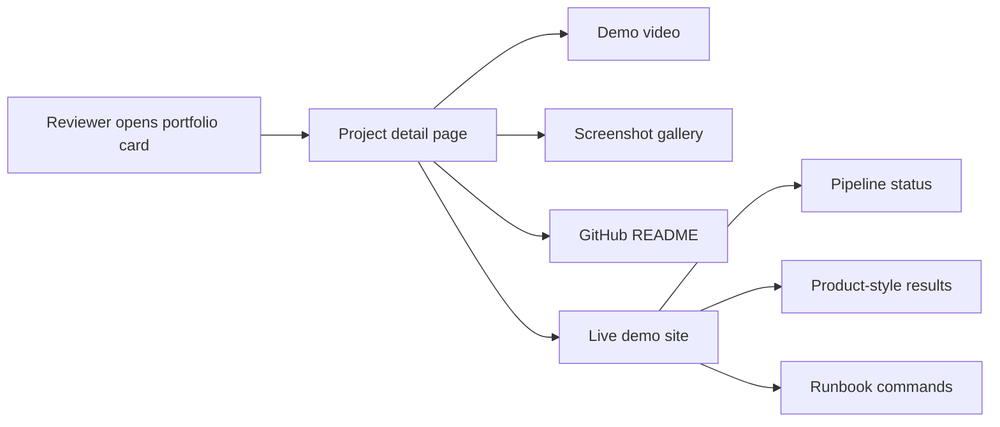
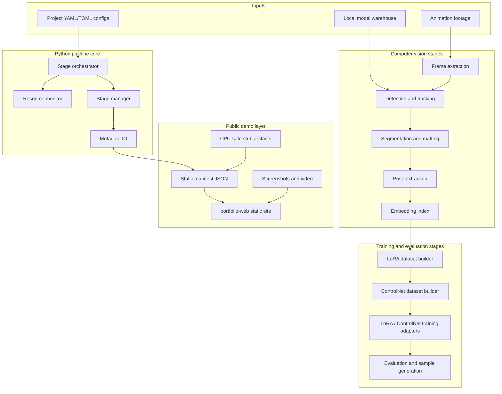
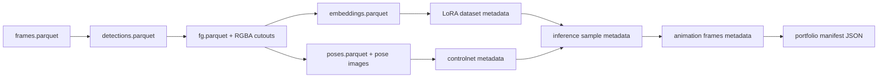
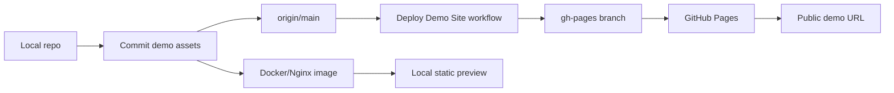

# 3D Animation LoRA Pipeline

Portfolio-ready data engineering and training pipeline for animation LoRA datasets. The project turns animation footage into staged artifacts: frames, detections, foreground/background cutouts, pose records, embeddings, LoRA-ready datasets, inference samples, animation frames, and a public demo layer that is safe to show without private media or model weights.

The repository is intentionally file-driven. There is no production database or hosted API server. YAML/TOML configs, parquet metadata, image artifacts, and static JSON manifests are the contracts between stages.

## Demo Links

| Asset | URL / Path | Purpose |
| --- | --- | --- |
| Public demo site | https://justin21523.github.io/3d-animation-lora-pipeline/ | Static product-style demo for interview review |
| Portfolio case study | https://justin21523.github.io/zh-TW/projects/3d-animation-lora-pipeline/ | Main portfolio page with card, screenshots, recording, and links |
| Local static site | `portfolio-web/index.html` | Source for the published demo |
| Demo manifest | `portfolio-web/demo-data/manifest.json` | Frontend data contract for stages, scenarios, metrics, and media |
| Demo screenshots | `portfolio-web/assets/screenshots/` | Review-ready screenshots |
| Demo video | `portfolio-web/assets/video/demo-walkthrough.mp4` | Short walkthrough recording |

## Quick Reviewer Path

```bash
pip install -r requirements/core.txt -r requirements/dev.txt
python scripts/demo/run_demo_pipeline.py --skip-pipeline
python -m pytest tests/demo -q
python -m http.server 8080 -d portfolio-web
```

Open `http://localhost:8080`.

If you want the full demo-safe smoke suite:

```bash
./tests/run_tests.sh
```

## What This Project Demonstrates

| Area | What is shown | Why it matters in an interview |
| --- | --- | --- |
| ML data engineering | Stage outputs are tracked as files and metadata | Shows reproducible data contracts, not only model prompting |
| Computer vision pipeline | Extraction, tracking, segmentation, pose, embeddings | Shows multi-stage CV orchestration and artifact handling |
| Training readiness | LoRA/ControlNet dataset assembly and training adapters | Shows awareness of real training constraints |
| Demo safety | CPU-safe stub mode and synthetic public assets | Lets reviewers run it without private media, GPUs, or secrets |
| Product presentation | Static site, screenshots, video, portfolio integration | Makes the work understandable in a few minutes |
| Deployment | GitHub Pages, Docker/Nginx static hosting | Shows practical release packaging |

## Product Demo Flow



The first screen of the demo shows the product itself: stage readiness, metrics, and result artifacts. It is not just a marketing landing page.

## System Architecture



## Data Contracts



Each stage produces inspectable metadata. The public demo reads the final manifest and renders the same stage model in the browser.

## Pipeline Stage Matrix

| Order | Stage | Output contract | Demo-safe? | Real workflow dependency |
| --- | --- | --- | --- | --- |
| 1 | Frame extraction | `metadata/frames.parquet`, frame images | Yes | Video decoder, scene detection |
| 2 | Perceptual dedupe | `metadata/frames_dedupe.parquet` | Yes | CPU image hashing |
| 3 | Detection and tracking | `metadata/detections.parquet` | Yes | YOLO/ByteTrack or stub detections |
| 4 | Foreground/background split | `metadata/fg.parquet`, RGBA cutouts | Yes | SAM/ToonOut/LaMa-style components |
| 5 | Pose conditioning | `metadata/poses.parquet`, pose previews | Yes | MediaPipe/DWPose for real data |
| 6 | Embedding index | `metadata/embeddings.parquet` | Yes | CLIP embeddings for real data |
| 7 | LoRA dataset | `lora_datasets/.../metadata.parquet` | Yes | Captioning and dataset assembly |
| 8 | ControlNet dataset | `controlnet_datasets/.../metadata.parquet` | Yes | Pose-conditioned dataset assembly |
| 9 | Inference samples | `outputs/inference/metadata.parquet` | Yes | Diffusers/ComfyUI for real samples |
| 10 | Animation export | `outputs/animation/.../metadata.parquet` | Yes | Upscale/interpolation stack for real video |

## Repository Map

```text
.
|-- anime_pipeline/          Packaged 2D/3D pipeline library
|-- scripts/
|   |-- core/pipeline/       Main staged orchestrator CLI
|   |-- demo/                Demo manifest and public asset generator
|   |-- generic/             Reusable video, segmentation, clustering, quality, training tools
|   |-- batch/               Long-running generation/training automation
|   |-- training/            Training launchers, monitoring, checkpoint evaluation
|   `-- monitoring/          Progress and health scripts
|-- configs/                 Global, stage, project, batch, training, and evaluation configs
|-- portfolio-web/           Public static demo website
|-- docker/                  Nginx static hosting package
|-- tests/                   Demo-safe smoke tests and focused pytest suites
|-- requirements/            Modular dependency sets
`-- .github/workflows/       GitHub Pages demo deployment workflow
```

## Frontend, Backend, Data, API, Deployment

| Layer | Implementation | Current status |
| --- | --- | --- |
| Frontend | Static HTML/CSS/JS in `portfolio-web/` | Works locally and on GitHub Pages |
| Backend | Python CLI and file-based pipeline stages | No persistent service; demo-safe CLI works |
| Database | None | Parquet/CSV/JSON files are the data contracts |
| API | None for public demo | Static manifest is fetched by the browser |
| Real ML runtime | Local GPU workstation workflow | Requires model/data warehouse and compatible CUDA stack |
| Demo runtime | CPU-safe manifest and synthetic assets | Works without private data, GPU, external APIs, or model weights |
| Deployment | GitHub Pages via `gh-pages`, plus Docker/Nginx | Verified public demo and media URLs |

## Demo Scenarios

| Scenario | What to show | Time |
| --- | --- | --- |
| Fast portfolio review | Open portfolio page, play demo video, inspect gallery | 1-2 minutes |
| Product demo | Open public demo site, scroll Results -> Pipeline -> Media | 3-5 minutes |
| Engineering review | Run demo manifest generator and tests locally | 5 minutes |
| Architecture review | Walk through README diagrams and stage matrix | 5-10 minutes |
| Deployment review | Show GitHub Pages workflow and Docker image build | 3 minutes |

## Local Demo Commands

Install only the demo-safe dependencies:

```bash
pip install -r requirements/core.txt -r requirements/dev.txt
```

Refresh the manifest from existing CPU-safe outputs:

```bash
python scripts/demo/run_demo_pipeline.py --skip-pipeline
```

Run the complete stub pipeline first, then refresh the manifest:

```bash
bash bash/run_full_pipeline_stub.sh
python scripts/demo/run_demo_pipeline.py --skip-pipeline
```

Serve the static demo:

```bash
python -m http.server 8080 -d portfolio-web
```

Build and serve through Docker:

```bash
docker build -f docker/portfolio.Dockerfile -t 3d-animation-lora-pipeline-demo .
docker run --rm -p 8080:80 3d-animation-lora-pipeline-demo
```

## Testing and Verification

| Check | Command | Expected result |
| --- | --- | --- |
| Demo manifest unit tests | `python -m pytest tests/demo -q` | 3 passing tests |
| Demo-safe smoke suite | `./tests/run_tests.sh` | Focused CPU-safe suite passes |
| Static Docker build | `docker build -f docker/portfolio.Dockerfile -t 3d-animation-lora-pipeline-demo .` | Nginx image builds |
| Static asset HTTP check | `curl -I http://localhost:8080/assets/video/demo-walkthrough.mp4` | `200 OK` |
| Pipeline config/status smoke | `python -m scripts.core.pipeline status --project <project_id>` | Stage list renders without crash |

Full `python -m pytest tests/` can require GPU/model dependency alignment because several tests touch heavy diffusers, inpainting, training, or local model paths.

## Real Model Workflow

Real model runs are workstation jobs, not hosted website jobs.

```bash
pip install -r requirements/all.txt
bash scripts/setup/install_pipeline_dependencies.sh
python -m scripts.core.pipeline validate --project <project_id>
python -m scripts.core.pipeline run --project <project_id> --device cuda
```

Common requirements:

| Requirement | Why it is needed |
| --- | --- |
| CUDA-capable GPU | Real segmentation, embeddings, diffusion inference, training |
| Local model warehouse | Avoids committing model weights |
| Dataset warehouse | Stores raw media and generated artifacts outside git |
| Optional `OPENAI_API_KEY` or `LLM_VENDOR_API_KEY` | Only for API-based captioning/refinement workflows |
| Optional ComfyUI | Visual workflow comparison and generation tests |

## Deployment Architecture



The ML pipeline does not run on GitHub Pages. Pages only hosts `portfolio-web/`, static screenshots, demo video, and the generated manifest.

## Current Status

| Area | Status | Evidence |
| --- | --- | --- |
| Demo-safe pipeline | Working | `python scripts/demo/run_demo_pipeline.py --skip-pipeline` |
| Demo tests | Working | `python -m pytest tests/demo -q` |
| Smoke suite | Working | `./tests/run_tests.sh` |
| Static site | Working | `portfolio-web/` local server and public Pages URL |
| Docker static package | Working | `docker/portfolio.Dockerfile` builds |
| Portfolio integration | Working | Main portfolio page links to demo, screenshots, video, GitHub, README |
| Real GPU training | Environment-dependent | Requires local model/data warehouse and CUDA stack |
| Hosted backend/API | Not applicable | The public demo is intentionally static |

## Known Risks and Limits

| Risk | Impact | Mitigation |
| --- | --- | --- |
| Real model workflows depend on local GPU and model paths | Cannot be fully reproduced on CPU-only machines | Public demo uses deterministic mock-safe artifacts |
| Large generated media/checkpoints are intentionally untracked | Reviewers cannot inspect private raw training data | README and demo show anonymized stage outputs |
| Some scripts are research/batch oriented | Full repo contains more tools than the interview path needs | Demo-safe commands and docs define the stable path |
| Optional API captioning needs secrets | Public CI cannot call external captioning APIs | API paths are not required for demo-safe tests |
| GitHub Pages is static only | Cannot run real ML inference in browser | Real pipeline remains CLI/workstation; static demo shows results |

## Interview Highlights

Reviewers should focus on:

- File-based ML data contracts through parquet/JSON manifests.
- Config-driven orchestration rather than hard-coded one-off scripts.
- Clear separation between real GPU workflows and CPU-safe public demo mode.
- Public demo assets that are safe to screenshot, record, and publish.
- Docker and GitHub Pages deployment packaging for a static technical showcase.
- Main portfolio integration with cover, gallery, video, demo link, GitHub, and README.

## Privacy and Data Notes

Raw media, model weights, generated datasets, checkpoints, logs, and secrets are intentionally excluded from git. Public assets in `portfolio-web/` are synthetic/anonymized demonstration files intended for portfolio review.
